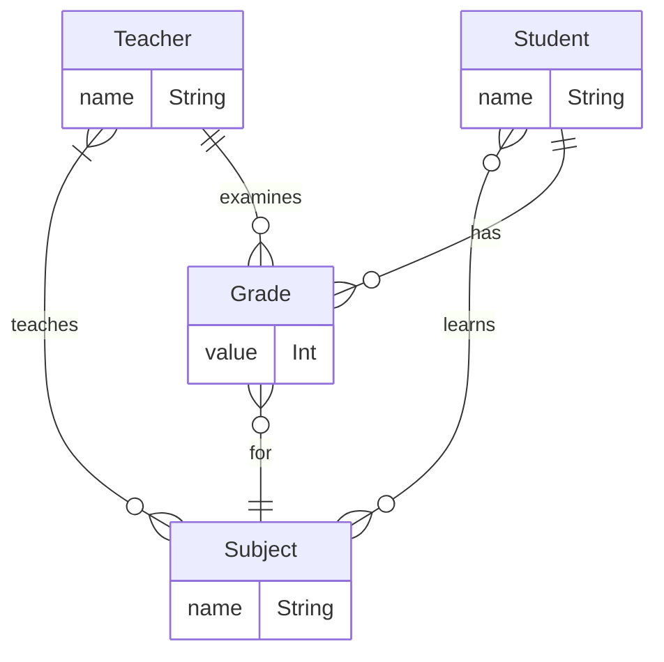

# GraphQL over HATEOAS

## Entity relationship

A `Grade` is given to a `Student`, for a `Subject`, by a `Teacher`.



## Run the project v1

Build the `hal-server` and `graphql-server` JARs first:

```sh
./gradlew build
```

Then to start the docker containers:

```sh
docker compose up -d
```

## Run the project v2

Build the `hal-server` module first:

```sh
./gradlew build
```

Build the Docker image:

```sh
docker build -t hal-server .
```

Run the `hal-server` image:

```sh
docker run -d -p 8080:8080 hal-server:latest  
```

Follow same steps for `graphql-server`:

```sh
./gradlew build
```

Build the Docker image:

```sh
docker build -t graphql-server .
```

Run the `graphql-server` image:

```sh
docker run -d -p 8090:8080 -e HAL_SERVER=http://192.168.100.14:8080 graphql-hal:latest
```

Note: you can not use `localhost` for the `HAL_SERVER` environment variable because it will try to look for it inside Docker.

Note2: to get the IP you need to put in the `HAL_SERVER`, use either `ifconfig` or `ipconfig` in a command line on your system.
